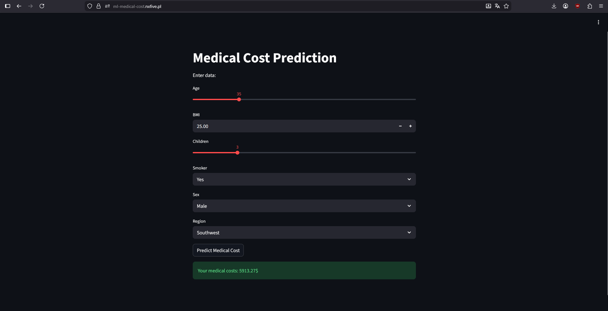
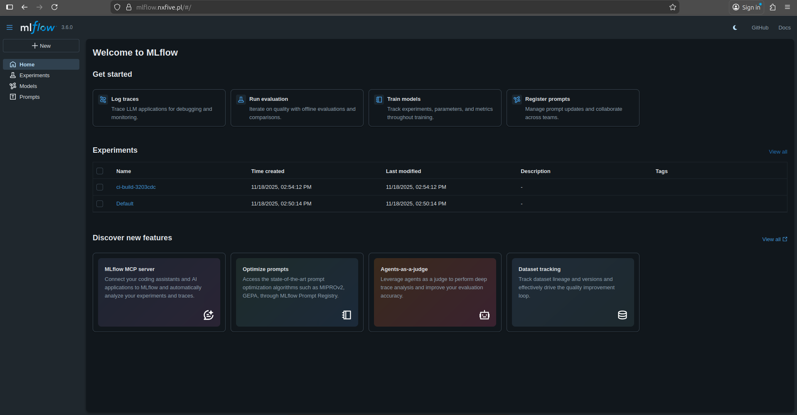
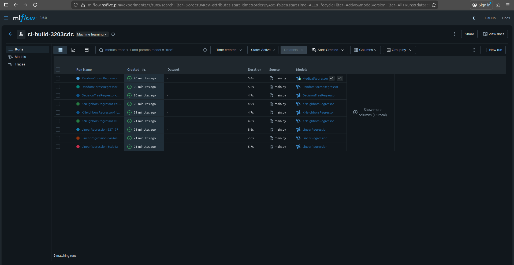
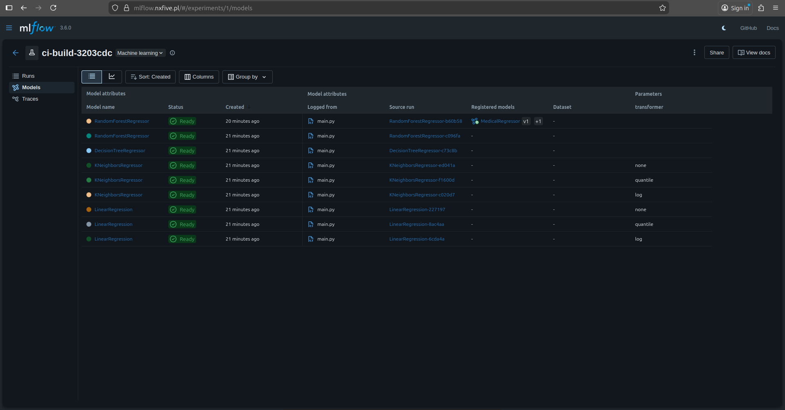
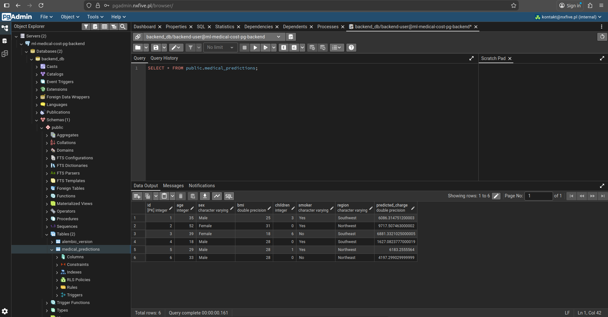
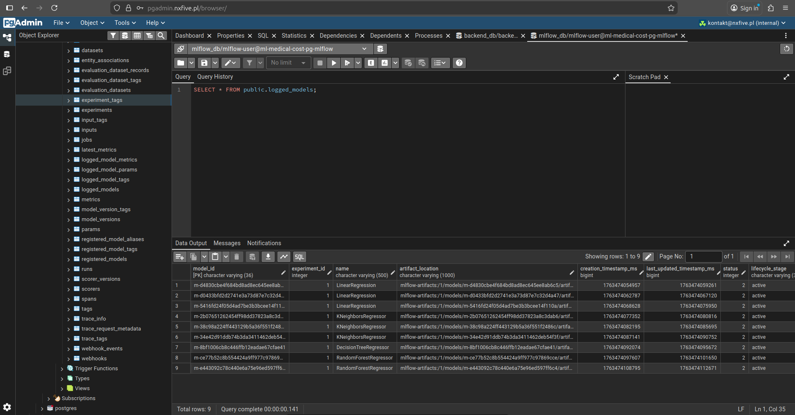
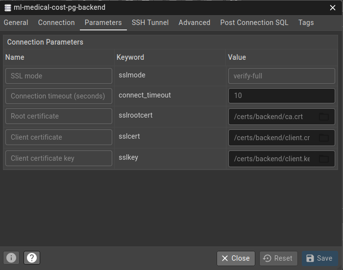

# 🚀 Production-ready Medical Cost Prediction Service  (FastAPI + BentoML + MLflow)

This project demonstrates how to design and implement a secure, production-ready machine learning system — from experimentation to deployment — using modern MLOps tools.

## 🎯 Project Goal

The goal of this project was to build a complete, production-ready machine learning pipeline covering model training, optimization, registration, and serving, with a strong focus on architecture quality and security.

### 1️⃣ MLflow and BentoML Integration

- Integration of MLflow for experiment tracking, metrics logging, and model versioning

- In a later stage:

  - loading registered models from MLflow
  - registering them in BentoML
  - exposing the model as a production-ready service (API)

### 2️⃣ Architecture and Code Quality

The project was designed in accordance with:

- Clean Architecture – clear separation of responsibilities and layers
- SOLID principles – with particular emphasis on SRP and DIP
- DRY – avoiding duplicated logic
- YAGNI – no premature abstractions
- Design patterns (builder, factory, orchestrator, service) used only where they provided real value

### 3️⃣ Security 

- Access to MLflow and PostgreSQL (pgAdmin) is available only by VPN

---
## 🌊 Project Flow

The project is organized into explicit execution stages, each responsible for a single part of the machine learning lifecycle.

### 1️⃣ Training Stage (stage=training)

- Each model is trained once per stage
- Models are evaluated using cross-validation and train/test metrics
- Metrics and artifacts are logged to MLflow

The goal of this stage is model comparison, not heavy optimization.  Prevents unnecessary hyperparameter tuning on weak models.

### 2️⃣ Optimization Stage (stage=optuna)

- Only the best-performing model from the training stage is selected
- Hyperparameter optimization is performed using Optuna

The optimized model is:
- logged to MLflow
- registered in the MLflow Model Registry

This stage focuses on improving model, keeping optimization efficient and controlled.

### 3️⃣ Serving Stage

- The selected model is loaded directly from MLflow
- The model is registered in BentoML
- A BentoML service is created for model inference
- A FastAPI backend communicates with the BentoML service and exposes the public API

This stage provides a clear separation between:

- model serving (BentoML)
- application / API layer (FastAPI)

---

## 🔒 Security

**VPN & isolated network:** Access to MLflow and PostgreSQL is secured via VPN; databases run in a separate Docker network.

**TLS/SSL:** All database connections are encrypted with client-server certificates. Each client has its own certificate tied to a specific database user.

**Restricted access & firewall:** Only essential ports for the application, MLflow, and pgAdmin are exposed; all others are blocked.

**Secure environment variables:** Sensitive information is stored as Docker secrets.

**Additional protections:** Non-standard SSH port, rate limiting via Traefik, and safeguards against unauthorized access.

---

## 🛠️ Tech Stack

- **Programming Language:** Python, Bash
- **Backend & ML:** FastAPI, BentoML, scikit-learn, Optuna, MLflow, NumPy, Pandas
- **Frontend:** Streamlit
- **Configuration:** Hydra, OmegaConf
- **Database:** PostgreSQL, pgAdmin, Alembic, SQLAlchemy
- **Testing:** Pytest
- **Deployment & CI/CD:** Docker Swarm, GitHub Actions (self-hosted runner), Traefik
- **Version Control & Data Management:** Git, DVC
- **Security & Networking:** WireGuard, OpenSSL, Fail2Ban, nftables

---

## 🖥️ System Architecture

                                ┌───────────────┐
                                │    Client     │
                                └───────┬───────┘
                                        │[HTTPS]
                                        ▼
                              ┌─────────────────────┐
                              │       Traefik       │
                              │   (Reverse Proxy)   │
                              │                     │
                              └──────────┬──────────┘
                                         │[HTTP]
                                         ▼
                        ┌──────────────────┬───────────────────────┐
                      [VPN]              [VPN]                     │
                        ▼                  ▼                       ▼              
                   ┌─────────────┐   ┌─────────────┐         ┌───────────┐  
                   │  Mlflow     │   │   PgAdmin   │         │  App UI   │  
                   │             │   │             │         │           │
                   └────────┬────┘   └─┬─────────┬─┘         └──────┬────┘  
                     ▲      │          │         │                  │
                     │      │[TLS]     │[TLS]    │[TLS]             │[HTTP]
                     │      ▼          ▼         ▼                  │      
                     │    ┌─────────────┐    ┌────────────┐         │
                     │    │  Postgres   │    │  Postgres  │         │
                     │    │ (Mlflow DB) │    │  (App DB)  │         │
                     │    └─────────────┘    └────────────┘         │
                     │                           ▲                  │
                     │[HTTP]                   [TLS]                │
                     └──────────────────────┐    │    ┌─────────────┘
                                            │    │    ▼
                                          ┌─┴────┴──────┐
                                          │   FastAPI   |
                                          │ Backend API |
                                          │             │
                                          └──────┬──────┘
                                                 │[HTTP]
                                                 ▼
                                          ┌─────────────┐
                                          │   BentoML   |
                                          │  Model API  |
                                          │             │
                                          └─────────────┘

## 📸 Screenshots

### Dashboard

### MLflow

### MLflow Experiments - Runs

### MLflow Experiments - Models

### PgAdmin Backend Database

### PgAdmin MLflow Database

### PgAdmin Backend/MLflow SSL/TLS config

### Test Coverage

